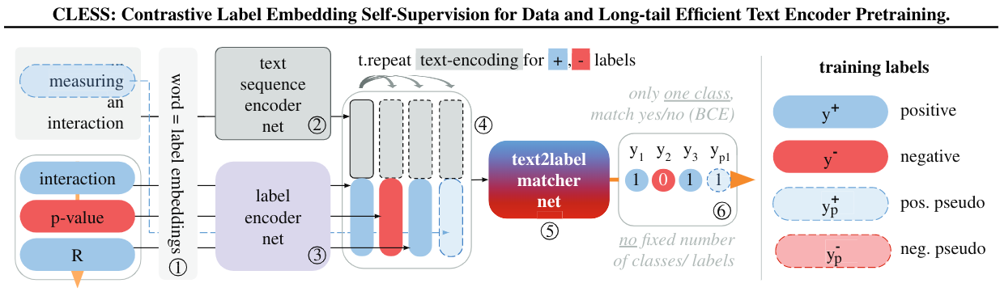
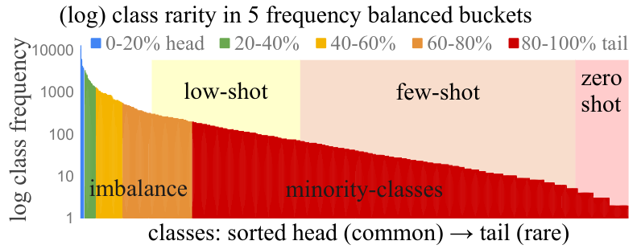
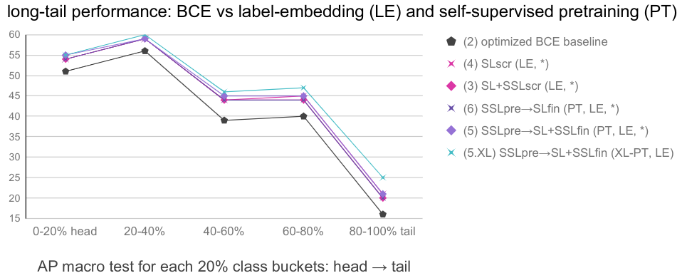
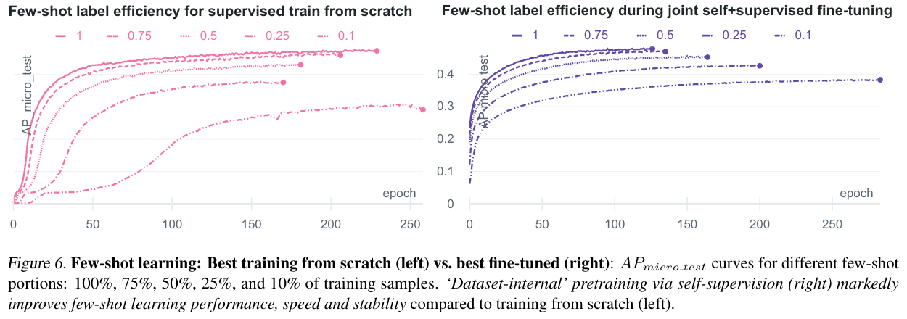

# CLESS -- Long-Tail Zero and Few-Shot Learning via Contrastive Pretraining on and for Small Data
Repository for the paper "Long-Tail Zero and Few-Shot Learning via Contrastive Pretraining on and for Small Data", Nils Rethmeier, Isabelle Augenstein, 2020

# :computer: Code
To be updated soon. In the meantime, you can aquire code and data by reaching out to the paper email.


## Summary
CLESS, uses contrastive label-embedding self-supervision to enable data efficient text encoder pretraining that is inherently zero-shot transferable and improves long-tail minority learning.
<p align="left"https://github.com/NilsRethmeier/CLESS>


We examine learning on a challenging long-tailed, low-resource, multi-label text classification dataset with noisy, highly sparse labels and many minority concepts. 
<p align="left">

<!-- We find that long-tail, ...
<p align="left">

self-supervised zero and few-shot learning markedly benefit from increasing 'dataset-internal' self-supervised training signal, which helps reduce reliance on large external sources.
<p align="left">-->


# :scroll: [Paper](https://arxiv.org/abs/2010.01061)

This is an updated version and the future code repository for the paper "Long-Tail Zero and Few-Shot Learning via Contrastive Pretraining on and for Small Data", Nils Rethmeier, Isabelle Augenstein, 2 Oct 2020, https://arxiv.org/abs/2010.01061
 -->

# :bookmark_tabs: bitex
```
@misc{rethmeier2020longtail,
    title={Long-Tail Zero and Few-Shot Learning via Contrastive Pretraining on and for Small Data},
    author={Nils Rethmeier and Isabelle Augenstein},
    year={2020},
    eprint={2010.01061},
    archivePrefix={arXiv},
    primaryClass={cs.CL}
}
```
