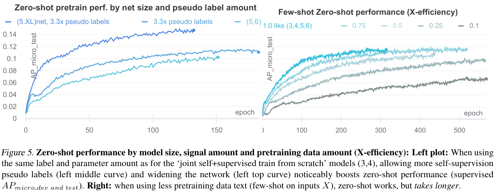

# CLESS -- Contrastive Label Embedding Self-Supervion
Repository for the paper "CLESS: Contrastive Label Embedding Self-supervised Zero to Few-shot Learning from and for Small, Long-tailed Text Data" 

## Summary
CLESS, uses contrastive label-embedding self-supervision to enable data efficient text encoder pretraining that is inherently zero-shot transferable and improves long-tail minority learning.
<p align="left">


We examine learning on a challenging long-tailed, low-resource, multi-label text classification dataset with noisy, highly sparse labels and many minority concepts. 
<p align="left">

We find that long-tail, ...
<p align="left">

self-supervised zero-shot learning ...
<p align="left">

and few-shot learning markedly benefit from increasing 'dataset-internal' self-supervised training signal, which helps reduce reliance on large external sources.
<p align="left">

# preprint 
Contrastive_Label_Embedding_Self-Supervion_2020.pdf
This is an updated version and the future code repository for the paper "Long-Tail Zero and Few-Shot Learning via Contrastive Pretraining on and for Small Data", Nils Rethmeier, Isabelle Augenstein, 2020, https://arxiv.org/abs/2010.01061


# Code
Code and arxiv paper will be updated, but not during annonymity deadlines of specific conferences, as they prohibit public updates :(

# bitex
```
@misc{rethmeier2020longtail,
    title={CLESS: Contrastive Label Embedding Self-supervised Zero to Few-shot Learning from and for Small, Long-tailed Text Data},
    author={Nils Rethmeier and Isabelle Augenstein},
    year={2020},
    eprint={2010.01061},
    archivePrefix={arXiv},
    primaryClass={cs.CL}
}
```
